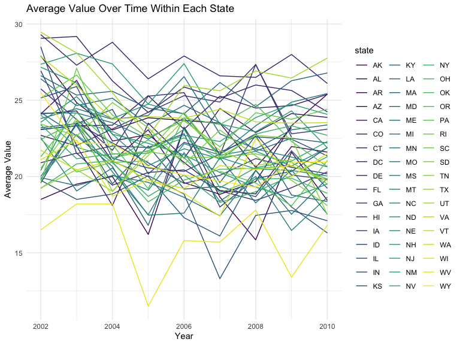
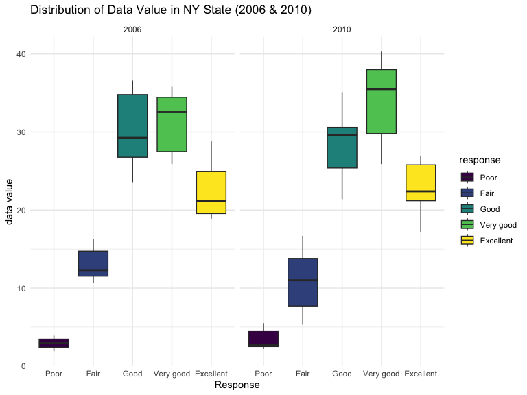
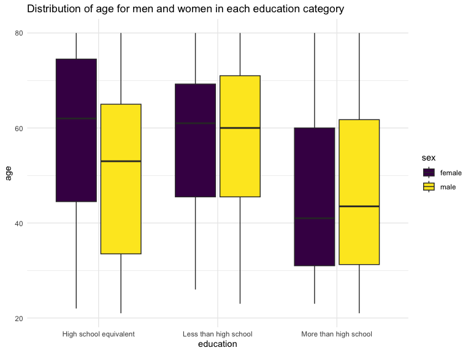
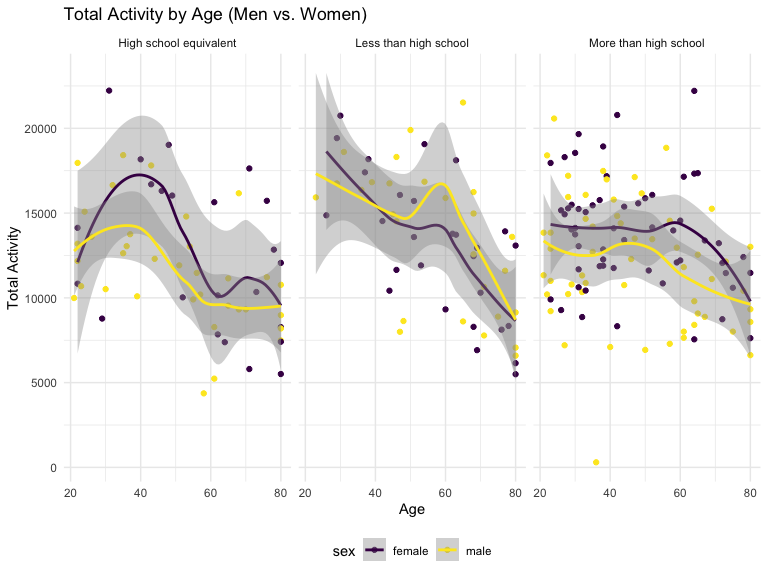
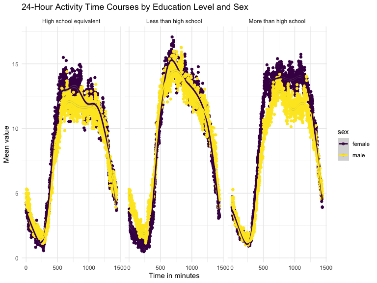
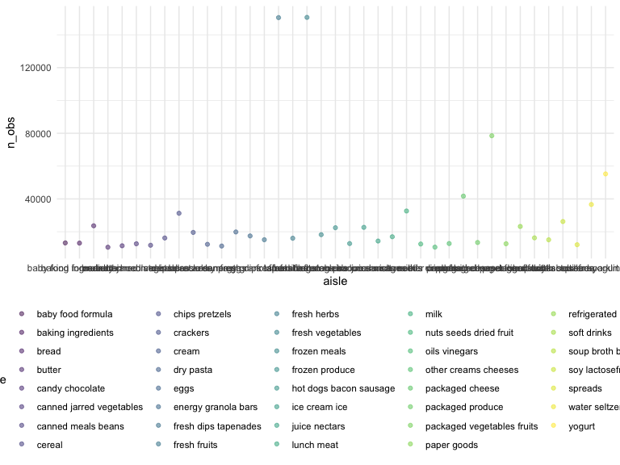

p8105_hw3_yw4199
================
Yaduo Wang
2023-10-10

Load packages and datasets

Set graphic options.

``` r
knitr::opts_chunk$set(
    echo = TRUE,
    warning = FALSE,
    fig.width = 8, 
  fig.height = 6,
  out.width = "90%"
)

theme_set(theme_minimal() + theme(legend.position = "bottom"))

options(
  ggplot2.continuous.colour = "viridis",
  ggplot2.continuous.fill = "viridis"
)

scale_colour_discrete = scale_colour_viridis_d
scale_fill_discrete = scale_fill_viridis_d
```

## Problem 2

``` r
library(p8105.datasets)
data("brfss_smart2010")
```

First, do some data cleaning: format the data to use appropriate
variable names; focus on the “Overall Health” topic include only
responses from “Excellent” to “Poor” organize responses as a factor
taking levels ordered from “Poor” to “Excellent”

``` r
brfss_df = 
  brfss_smart2010 |> 
  janitor::clean_names() |> 
  rename(state = locationabbr, location = locationdesc) |> 
  filter(topic == "Overall Health", 
         response %in% c("Poor", "Fair", "Good", "Very good", "Excellent")) |> 
  mutate(response = factor(response, levels = c("Poor", "Fair", "Good", "Very good", "Excellent"), ordered = TRUE)) 
```

Using this dataset, do or answer the following (commenting on the
results of each):

In 2002, which states were observed at 7 or more locations? What about
in 2010?

``` r
brfss_df |> 
  filter(year == 2002) |> 
  group_by(state) |> 
  summarise(obs = n_distinct(location)) |> 
  filter(obs >= 7)
```

    ## # A tibble: 6 × 2
    ##   state   obs
    ##   <chr> <int>
    ## 1 CT        7
    ## 2 FL        7
    ## 3 MA        8
    ## 4 NC        7
    ## 5 NJ        8
    ## 6 PA       10

In 2002, states, CT, FL, MA, NC, NJ, PA are states that were observed at
7 or more locations.

``` r
brfss_df |> 
  filter(year == 2010) |> 
  group_by(state) |> 
  summarise(obs = n_distinct(location)) |> 
  filter(obs >= 7)
```

    ## # A tibble: 14 × 2
    ##    state   obs
    ##    <chr> <int>
    ##  1 CA       12
    ##  2 CO        7
    ##  3 FL       41
    ##  4 MA        9
    ##  5 MD       12
    ##  6 NC       12
    ##  7 NE       10
    ##  8 NJ       19
    ##  9 NY        9
    ## 10 OH        8
    ## 11 PA        7
    ## 12 SC        7
    ## 13 TX       16
    ## 14 WA       10

In 2010, states CA, CO, FL, MA, MD, NC, NE, NJ, NY, OH, PA, SC, TX, WA
are states that were observed at 7 or more locations.

Construct a dataset that is limited to Excellent responses, and
contains, year, state, and a variable that averages the data_value
across locations within a state.

``` r
brfss_df_new = 
  brfss_df |> 
  filter(response == "Excellent") |> 
  group_by(year, state) |> 
  mutate(average_data_value = mean(data_value)) |> 
  select(year, state, location, average_data_value)
```

Make a “spaghetti” plot of this average value over time within a state.

``` r
brfss_df_new |> 
  ggplot(aes(x = year, y = average_data_value, group = state))+
  geom_line(aes(color = state))+
  labs(
    title = "Average Value Over Time Within Each State",
    x = "Year",
    y = "Average Value") +
  theme_minimal()
```



From this plot, we can observe the average value over time across
different states. There is no general pattern overall showing here.

Make a two-panel plot showing, for the years 2006, and 2010,
distribution of data_value for responses (“Poor” to “Excellent”) among
locations in NY State.

``` r
brfss_df |> 
  filter(year %in% c(2006, 2010), state == "NY") |> 
  ggplot(aes(x = response, y = data_value, fill = response)) + 
  geom_boxplot() +
  facet_grid(. ~ year)+
  theme(legend.position = "none")+
  labs(
    title = "Distribution of Data Value in NY State (2006 & 2010)",
    x = "Response",
    y = "data value"
  )+
  theme_minimal()
```



In NY state, in both 2006 and 2010, the “Good” and ” Very good”
responses show highest value, with highest median from the boxplot, and
“Poor” response shows the lowest value according to their median.

## Problem 3

Load, tidy, merge, and otherwise organize the data sets. Your final
dataset should include all originally observed variables; exclude
participants less than 21 years of age, and those with missing
demographic data; and encode data with reasonable variable classes.

``` r
nhanes_data = read_csv(file = "nhanes_covar.csv", skip = 4)
```

    ## Rows: 250 Columns: 5
    ## ── Column specification ────────────────────────────────────────────────────────
    ## Delimiter: ","
    ## dbl (5): SEQN, sex, age, BMI, education
    ## 
    ## ℹ Use `spec()` to retrieve the full column specification for this data.
    ## ℹ Specify the column types or set `show_col_types = FALSE` to quiet this message.

``` r
nhanes_data_clean = nhanes_data |> 
  janitor::clean_names() |> 
  filter(age >= 21) |> 
  drop_na() |> 
  mutate(
    sex = 
      case_match(
        sex, 
        1 ~ "male", 
        2 ~ "female"),
    sex = as.factor(sex)) |> 
  mutate(
    education = 
      case_match(
        education, 
        1 ~ "Less than high school", 
        2 ~ "High school equivalent",
        3 ~ "More than high school"),
    education = as.factor(education)) 

accel_df = 
  read_csv(file = "nhanes_accel.csv") |> 
  janitor::clean_names()
```

    ## Rows: 250 Columns: 1441
    ## ── Column specification ────────────────────────────────────────────────────────
    ## Delimiter: ","
    ## dbl (1441): SEQN, min1, min2, min3, min4, min5, min6, min7, min8, min9, min1...
    ## 
    ## ℹ Use `spec()` to retrieve the full column specification for this data.
    ## ℹ Specify the column types or set `show_col_types = FALSE` to quiet this message.

``` r
merged_data = merge(nhanes_data_clean, accel_df, by = "seqn")
```

Produce a reader-friendly table for the number of men and women in each
education category.

``` r
merged_data |> 
  group_by(sex, education) |> 
  summarize(count = n()) |> 
  knitr::kable()
```

    ## `summarise()` has grouped output by 'sex'. You can override using the `.groups`
    ## argument.

| sex    | education              | count |
|:-------|:-----------------------|------:|
| female | High school equivalent |    23 |
| female | Less than high school  |    28 |
| female | More than high school  |    59 |
| male   | High school equivalent |    35 |
| male   | Less than high school  |    27 |
| male   | More than high school  |    56 |

Create a visualization of the age distributions for men and women in
each education category. Comment on these items.

``` r
merged_data |> 
  ggplot(aes(x = education, y = age, fill = sex))+
  geom_boxplot()+
  labs(
    title = "Distribution of age for men and women in each education category",
    x = "education",
    y = "age"
  )+
  theme_minimal()
```



From the visualization, the age distribution for men and women in each
education category shows that in high school equivalent category, female
have generally 10 years higher age according to the median and the
distribution of the box plot. For both groups of less than high school
level and more than high school, female and male have generally equal
age.

Using your tidied dataset, aggregate across minutes to create a total
activity variable for each participant. Plot these total activities
(y-axis) against age (x-axis); your plot should compare men to women and
have separate panels for each education level. Include a trend line or a
smooth to illustrate differences. Comment on your plot.

``` r
merged_data |> 
  mutate(total_activity = rowSums(across(min1:min1440)), na.rm = TRUE) |> 
  ggplot(aes(x = age, y = total_activity, color = sex))+
  geom_point()+
  facet_grid(. ~ education)+
  geom_smooth() + 
  labs(x = "Age", y = "Total Activity") +
  ggtitle("Total Activity by Age (Men vs. Women)")
```

    ## `geom_smooth()` using method = 'loess' and formula = 'y ~ x'



From the graph, we can generally see in all three groups and for both
female and male that there are general decrease of total activity as age
increases. In both high school equivalent and more than high school
groups, male shows lower total activity than that of female. In the less
than high school group, before age 40, male shows lower total activity
than female, but the relationship reversed after age 40.

Make a three-panel plot that shows the 24-hour activity time courses for
each education level and use color to indicate sex. Describe in words
any patterns or conclusions you can make based on this graph; including
smooth trends may help identify differences.

``` r
merged_data |> 
  group_by(education, sex)|>
  summarise(across(starts_with("min"), ~ mean(.), .names = "mean_{.col}")) |>
  pivot_longer(cols = starts_with("mean_"), names_to = "time", values_to = "mean_value")|>
  mutate(time = as.numeric(substring(time, 9))) |> 
  ggplot(aes(x = time, y = mean_value, color = sex)) +
  geom_point() + 
  geom_smooth() +
  facet_grid(. ~ education) +
  labs(x = "Time in minutes", y = "Mean value") +
  ggtitle("24-Hour Activity Time Courses by Education Level and Sex") +
  theme_minimal()
```

    ## `summarise()` has grouped output by 'education'. You can override using the
    ## `.groups` argument.
    ## `geom_smooth()` using method = 'gam' and formula = 'y ~ s(x, bs = "cs")'



First, we use the mean value to compare the trend for 24-hour activity
time courses for each education level. Generally, Less than high school
education level group has highest mean value of MIMS values which is
between 15 and 16 around 500 to 750 minutes, and male have lower mean
value of MIMS values than that of female, especially between time in 500
and 1200 minutes. For all three education levels, the highest time in
minutes are around 500 to 1000.

## Problem 1

To that end, write a short description of the dataset, noting the size
and structure of the data, describing some key variables, and giving
illstrative examples of observations. Then, do or answer the following
(commenting on the results of each):

``` r
data("instacart")
nrow(instacart)
```

    ## [1] 1384617

``` r
head(instacart)
```

    ## # A tibble: 6 × 15
    ##   order_id product_id add_to_cart_order reordered user_id eval_set order_number
    ##      <int>      <int>             <int>     <int>   <int> <chr>           <int>
    ## 1        1      49302                 1         1  112108 train               4
    ## 2        1      11109                 2         1  112108 train               4
    ## 3        1      10246                 3         0  112108 train               4
    ## 4        1      49683                 4         0  112108 train               4
    ## 5        1      43633                 5         1  112108 train               4
    ## 6        1      13176                 6         0  112108 train               4
    ## # ℹ 8 more variables: order_dow <int>, order_hour_of_day <int>,
    ## #   days_since_prior_order <int>, product_name <chr>, aisle_id <int>,
    ## #   department_id <int>, aisle <chr>, department <chr>

How many aisles are there, and which aisles are the most items ordered
from?

``` r
instacart_df = 
  instacart |>
  group_by(aisle) |>
  summarize(n_obs = n()) |> 
  arrange(desc(n_obs))
head(instacart_df)
```

    ## # A tibble: 6 × 2
    ##   aisle                          n_obs
    ##   <chr>                          <int>
    ## 1 fresh vegetables              150609
    ## 2 fresh fruits                  150473
    ## 3 packaged vegetables fruits     78493
    ## 4 yogurt                         55240
    ## 5 packaged cheese                41699
    ## 6 water seltzer sparkling water  36617

Make a plot that shows the number of items ordered in each aisle,
limiting this to aisles with more than 10000 items ordered. Arrange
aisles sensibly, and organize your plot so others can read it.

``` r
instacart |>
  group_by(aisle) |>
  summarize(n_obs = n()) |>
  arrange(desc(n_obs)) |> 
  filter(as.numeric(n_obs) > 10000) |> 
  ggplot(aes(x = aisle, y = n_obs)) + 
  geom_point(aes(color = aisle), alpha = .5)
```



Make a table showing the three most popular items in each of the aisles
“baking ingredients”, “dog food care”, and “packaged vegetables fruits”.
Include the number of times each item is ordered in your table.

``` r
instacart |>
  filter(aisle %in% c("baking ingredients", "dog food care", "packaged vegetables fruits")) |>
  group_by(aisle) |> 
  count(product_name) |> 
  mutate(rank = min_rank(desc(n))) |> 
  filter(rank < 4) |> 
  arrange(desc(n)) |>
  knitr::kable()
```

| aisle                      | product_name                                  |    n | rank |
|:---------------------------|:----------------------------------------------|-----:|-----:|
| packaged vegetables fruits | Organic Baby Spinach                          | 9784 |    1 |
| packaged vegetables fruits | Organic Raspberries                           | 5546 |    2 |
| packaged vegetables fruits | Organic Blueberries                           | 4966 |    3 |
| baking ingredients         | Light Brown Sugar                             |  499 |    1 |
| baking ingredients         | Pure Baking Soda                              |  387 |    2 |
| baking ingredients         | Cane Sugar                                    |  336 |    3 |
| dog food care              | Snack Sticks Chicken & Rice Recipe Dog Treats |   30 |    1 |
| dog food care              | Organix Chicken & Brown Rice Recipe           |   28 |    2 |
| dog food care              | Small Dog Biscuits                            |   26 |    3 |

Make a table showing the mean hour of the day at which Pink Lady Apples
and Coffee Ice Cream are ordered on each day of the week; format this
table for human readers (i.e. produce a 2 x 7 table).

``` r
instacart |>
  filter(product_name %in% c("Pink Lady Apples", "Coffee Ice Cream")) |>
  group_by(product_name, order_dow) |>
  summarize(mean_hour = mean(order_hour_of_day)) |>
  pivot_wider(
    names_from = order_dow, 
    values_from = mean_hour) |>
  knitr::kable(digits = 2)
```

    ## `summarise()` has grouped output by 'product_name'. You can override using the
    ## `.groups` argument.

| product_name     |     0 |     1 |     2 |     3 |     4 |     5 |     6 |
|:-----------------|------:|------:|------:|------:|------:|------:|------:|
| Coffee Ice Cream | 13.77 | 14.32 | 15.38 | 15.32 | 15.22 | 12.26 | 13.83 |
| Pink Lady Apples | 13.44 | 11.36 | 11.70 | 14.25 | 11.55 | 12.78 | 11.94 |
